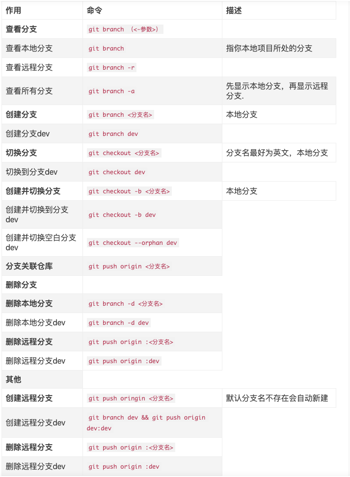

# Git指令

## 一. Git分支操作

### 1.1. 常用指令

参考文献：https://zhuanlan.zhihu.com/p/107692348

参考文献：https://www.cnblogs.com/BlueSkyyj/p/11935315.html

参考文献：https://blog.csdn.net/putao2062/article/details/80516001

## 二. Git一个仓库放置多个项目

参考文献：https://blog.csdn.net/qzw752890913/article/details/106245718/