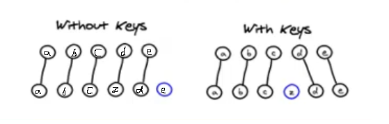
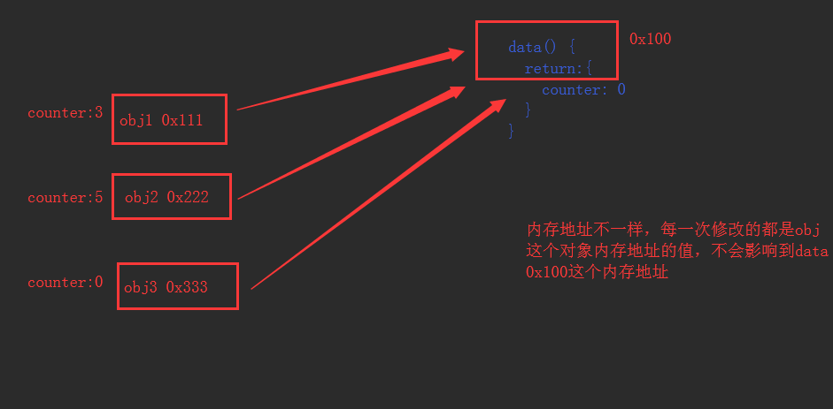
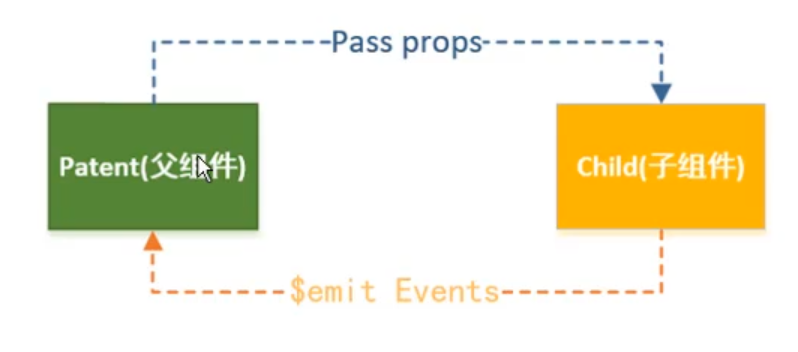
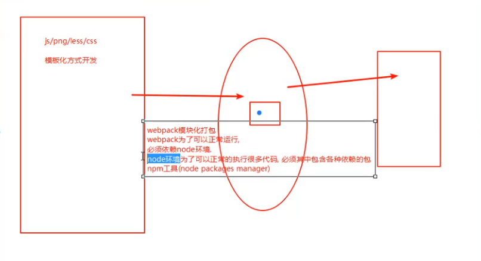
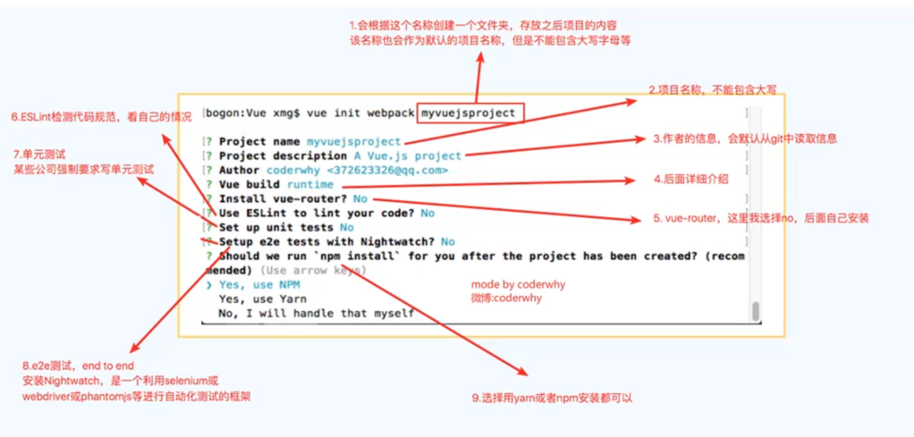
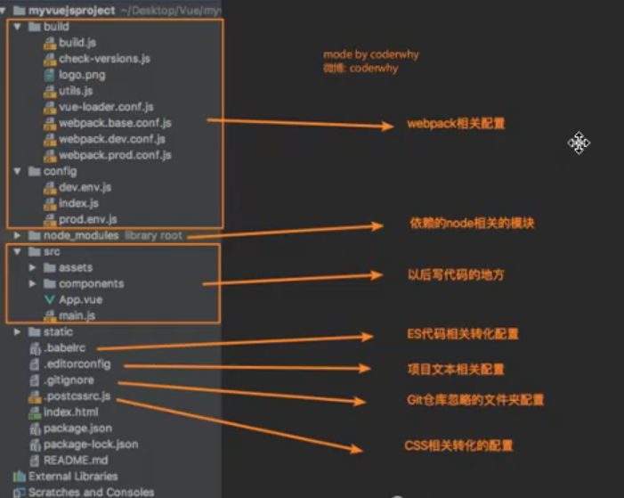
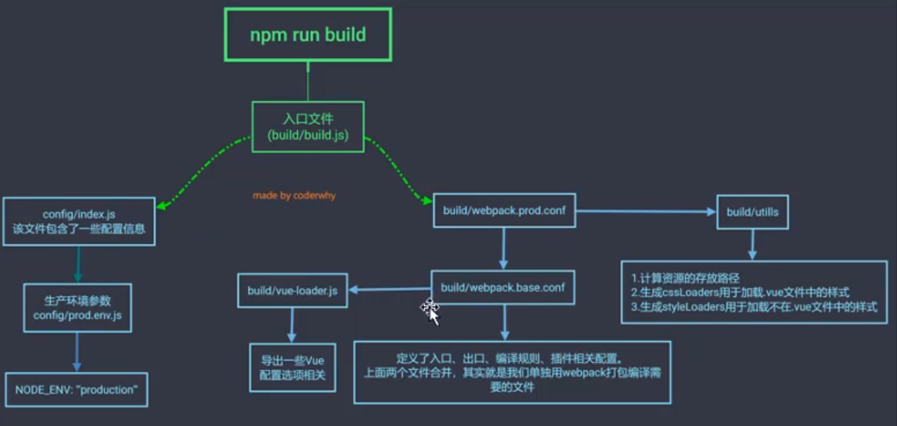
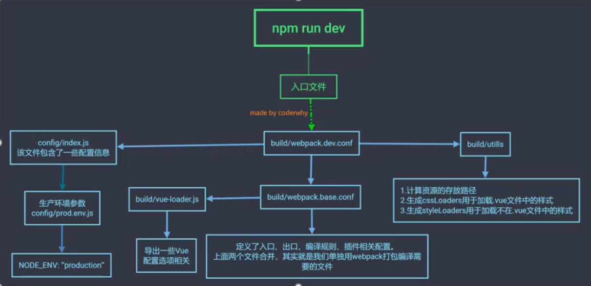
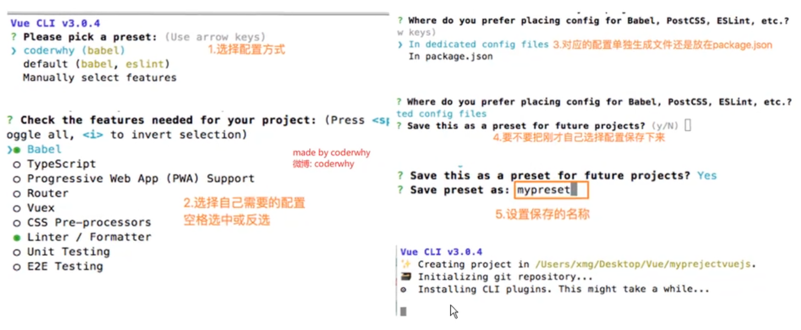
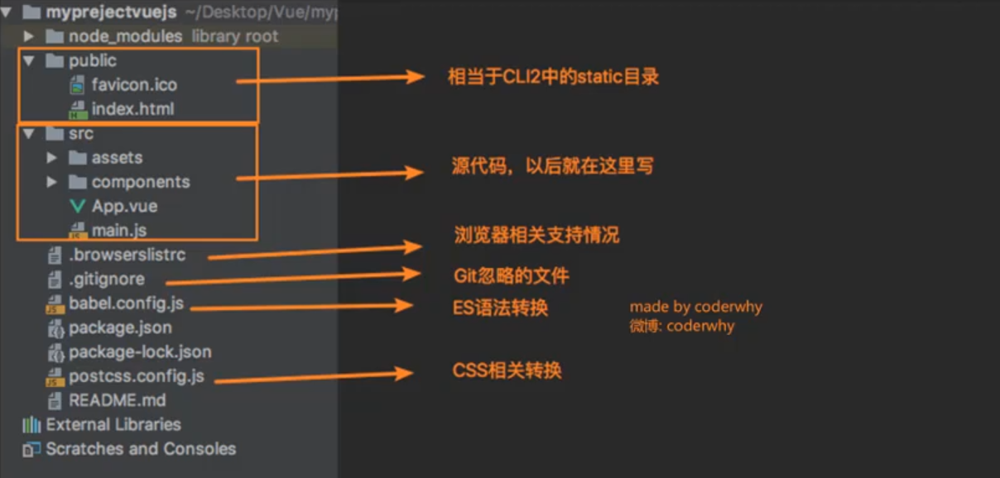

## 一.了解Vuejs

#### 1.1 安装有三种方法

- cdn引用

- 本地引用

```html
<script src="../js/vue.js"></script>
```

- npm安装

```
npm install vue --save
```

---------------------------------------------------------------

#### 1.2 渐进式：就是用你想用或者能用的功能特性，你不想用的部分功能可以先不用 不强求你一次性接受并使用他的全部功能

> 比如说  一个老项目使用jQuery写的  现在要使用Vue框架 不用一次全部改完
> 可以一个模块一个模块的改 直到jQuery代码完全改为Vue框架

---------------------------------------------------------------

```vue
const app=new Vue({
  //获取元素
  el: '#app',
  //数据
  data: {},
  //定义方法
  methods: {}
})
```

---

> Vuejs(编程范式： 声明式编程)
> 原生JS(编程范式： 命令式编程)

#### 1.3 基本指令

`v-for`
`v-on`

@ 语法糖： 简写

下面两者等价

```html
<button v-on:click="count++">+</button>
<button @click="count++">+</button>
```


#### 1.4 MVVM框架

Model    View     ViewModel
数据层   视图层     视图模型层
         DOM层

Model ViewModel View

ViewModel是 Model和View沟通的桥梁

他实现 Data Bindings 和 DOM Listeners
         数据绑定          DOM监听


#### 1.5 解析Vue对象

- el:
  类型 string | HTMLEement
  选择 要管理的元素

- data:
  类型 object | fn (组件中 data必须是一个函数)
  数据对象

- methods:
  类型 {[key: string]: fn}
  定义方法

#### 1.6 生命周期


三个常用生命周期函数：

- created() 组件被创建之后
- mounted() 被挂载到DOM之后
- updated() 页面发生改变之后

---

## 二.Vuejs基本语法及指令

2.1 基本指令

- `v-html` 解析内容标签
- `v-once`  值不会动态更改
- `v-text`  显示文本
- `v-pre`   当字符串处理 不解析元素内容
- `v-cloak` js加载完之前存在，加载完之后释放

#### 2.2 关于{{}}

> {{}} Mustache语法：胡须
> Mustache只能用于文本内容,不能用于属性

#### 2.3 `v-bind`指令

- v-bind  动态绑定属性

```html
 | <a v-bind:href=""></a>
```

- v-bind 语法糖 :

```html
 | <a :href=""></a>
```

- v-bind绑定class

  绑定方式使用 `{}`

  **{} 对象语法**

```html
<h2 :class="{key(类名): value(Boolean值),key(类名): value(Boolean值)}"></h2>
```

- 按钮点击 改变boolean值 直接取反即可

```javascript
        this.isAction = !this.isAction;
```

- 类过多  可以用 `methods` 或 `computed`

- v-bind绑定style

```html
<h2 :style="{key(属性名): value(属性值),key(属性名): value(属性值)}"></h2>
```

> 属性名可以使用驼峰标识

```html
<h2 :style="{fontSize: '50px'}"></h2> //属性值加'' 当字符串处理， 不加'' 当变量处理
```


## 三.Vuejs的计算属性

#### 3.1计算属性语法

```vue
computed: {
  fullName: function () {
    return this.firstName + ' ' + this.lastName;
  }
}
```

- 调用时不加()  被当做属性使用，而非函数 `{{fullName}}`

#### 3.2 计算属性完整方法 setter 和 getter

**setter不常用**

```vue
computed: {
  fullName: function () {
    set: function () {}  //计算属性一般是没有set方法  直接省略了，只读属性
    get: function () {
  	  return this.firstName + ' ' + this.lastName;
    }
  }
}
```

**下面是上面的简洁写法、**

```vue
computed: {
  fullName: function () {	//所以这钟写法只有get方法
    return this.firstName + ' ' + this.lastName;
  }
}
```

#### 3.3计算属性性能

- 计算属性 比 methods  效率更高

- 计算属性是有缓存的，也可以动态更新数据


## 四.`v-on`指令 事件监听

#### 4.1 v-on基本用法

**v-on 语法糖 @**

```html
<button v-on:click="count++">+</button>
<button @click="count++">+</button>
```

#### 4.2 v-on带参问题

```html
<!--1.方法带一个参数-->
  <!--调用方法时省略了小括号，但是方法本身是需要一个参数的，这个时候vue会默认将浏览器生产的event事件对象作为参数传入到方法-->
  <button @click="btn2Click">按钮2</button>
------------------------------------------------------
  <!--2.方法定义时，需要event对象，同时又需要其他参数-->
<!--在调用方法时，如何手动获取到浏览器参数的event对象：$event-->
<button @click="btn3Click('abc', $event)">按钮3</button>
```

#### 4.3 v-on修饰符

- `.stop`   阻止事件冒泡
- `.prevent`   阻止默认事件
- `.enter`  键修饰符，键别名
- `.once`   只触发一次
- `.native`
- `.stop.prevent`  串联修饰符


## 五. 条件判断

#### 5.1 基本指令

- `v-if`

- `v-else`

- `v-else-if`

#### 5.2 案例问题

- 用户输入的内容会被复用

```html
<!--isShow默认为true-->
<div id="app">
  <span v-if="isShow">
    <label for="username">用户名称</label>
    <input type="text" id="username" placeholder="用户名称">
  </span>
  <span v-else>
    <label for="email">用户邮箱</label>
    <input type="text" id="email" placeholder="用户邮箱">
  </span>
  <button @click="isShow = !isShow">切换</button>
</div>
```


- 问题解答:

> 1. 这是Vue在进行DOM渲染时，出于性能考虑，会尽可能的复用已经存在的元素，而不是创建新的元素
> 2. 这个案例中，Vue内部会发现原来的input元素不再使用，直接作为else中的input来使用

---

- 解决方案

```html
<!--isShow默认为true-->
<div id="app">
  <span v-if="isShow">
    <label for="username">用户名称</label>
    <input type="text" id="username" placeholder="用户名称" key="username"> //加入key  并且值不相同
  </span>
  <span v-else>
    <label for="email">用户邮箱</label>
    <input type="text" id="email" placeholder="用户邮箱" key="email">
  </span>
  <button @click="isShow = !isShow">切换</button>
</div>
```

**`key`相当于是一个标识，标识相同则可以复用，相反 则不能复用**

#### 5.3 `v-show`指令

```html
<!--isShow默认为true-->
<h2 v-show="isShow">Hello World!</h2>
```

#### 5.4 `v-if`和`v-show`的区别

- v-if

  当条件为false时,包含v-if指令的元素，不会存在dom中

- v-show

  当条件为false时,只是给元素添加一个行内样式: display: none

#### 5.5 两者如何选择

- 当显示与隐藏切换很频繁时，使用`v-show`，反之使用`v-if`


## 六.循环遍历

#### 	6.1 `v-for`指令

```vue
v-for="item in names"
```

#### 	6.2 遍历数组

1.获取值
2.带索引值

```vue
v-for="(item, index) in info"
```

#### 6.3 遍历对象

传参的三种方式

- 获取值

- 获取 键：key和值：value -> (value, key)

- 获取键：key、值：value、索引：index -> (value, key, index)

#### 6.4 v-for使用过程添加key

key属性

```html
<ul>
	<!-- :key的值要确保唯一性；对应index没用，当从中间插入一个值之后  下标改变-->
  <li v-for="item in arr" :key="item">{{item}}</li>
</ul>
```


为啥要加`key属性`？

> 这跟vue的虚拟DOM的Diff算法有关
>
> 提高效率

- 举例

有一个ABCDE列表，我们希望在CD中间插入一个Z

如图：



左边的没有加key，右边的加key

- 没有key:会更新C后边的所有DOM节点，

- 加key:原来的不变，插入一个新的节点

**key作用主要是为了高效的更新虚拟DOM**

---

## 七. 数组的哪些方法是响应式

#### 7.1 实现响应式

- push()    数组最后添加元素
- pop()     删除数组中的最后一个元素
- shift()   删除数组第一个元素
- unshift() 在数组最前边添加元素
- splice()  删除元素/插入元素/替换元素
- sort()    排序
- reverse() 反转


#### 7.2 没有响应式

- this.arr[0] = '123'


## 八. 购物车案例记录

#### 8.1 过滤器`filters`

```vue
filters: {
    showPrice(price) {
      return '￥' + price.toFixed(2);
    }
  }
```


- 过滤器的使用

```html
<!--调用时  不用写括号和参数  自动处理-->
<h2>总价格：{{totalPrice | showPrice}}</h2>
```


#### 8.2 移除当前行

```js
//要移除的行
removeHandle(index) {
  return this.books.splice(index, 1);
}
```


#### 8.3 购物车内没有条目时显示 "购物车为空"

```html
<div v-if="books.length > 0">
	...
</div>

<h2 v-else>购物车为空</h2>
```


#### 8.4 案例引出3个for循环

1. 普通`for`循环

   ```vue
   let totalPrice = 0;
         for( let i = 0; i < this.books.length; i++) {	//i相当于索引值
           totalPrice += this.books[i].price * this.books[i].count;
         }
         return totalPrice;
   ```

   

2. `for in`循环

   ```js
   let totalPrice = 0;
         for( let i in this.books) {	//i相当于索引值
           totalPrice += this.books[i].price * this.books[i].count;
         }
         return totalPrice;
   ```

   

3. `for of`循环

   ```js
   let totalPrice = 0;
         for (let item of this.books) {//item相当于对象
           totalPrice += item.price * item.count; //直接使用item
         }
         return totalPrice;
   ```

   ```js
   // 上边for-of循环转换为reduce  汇总
   return this.books.reduce(function (preValue, book) {
     return preValue + book.price * book.count;
   }, 0);
   ```

   

#### 8.5 案例引出的3个高阶函数

**filter/map/reduce**

1. `filter`函数：过滤

   - filter(Fn) 参数是个函数

- 返回值：Boolean值

  - 当返回为true时，函数内部会自动将这次回调的n加入到新的数组中
  - 当返回为false时，函数内部会过滤掉这次的n

  ```js
  let newNums = nums.filter(function (n) {
    return n <= 100;
  });
  ```


2. `map`函数：映射

   - map(Fn) 参数是个函数

   ```js
   let new2Nums = newNums.map(function (n) {
     return n * 2;
   });
   ```

3. `reduce`函数：汇总

   - reduce(参数一(Fn)，参数二(初始值))

   ```js
   let totalNum = new2Nums.reduce(function (preValue, n) { //函数里边有两个参数，参数一(上一次返回的值)，参数二(数组值)
     return preValue + n;
   }, 0); // 0 初始值，就是preValue第一次的值
   
   //代码实现的步骤解析
   // 第一次：preVlue 0 n 24
   // 第二次：preVlue 24 n 108
   // 第三次：preVlue 132 n 200
   // 第四次：preVlue 332 n 194
   // 第五次：preVlue 526 n 132
   // 658
   ```

demo：

```js
// --------------------最终缩写 S------------------------
        let total = nums.filter(function (n) {
          return n <= 100;
        }).map(function (n) {
          return n * 2;
        }).reduce(function (preValue, n) {
          return preValue + n;
        }, 0);

        console.log(total);
// --------------------最终缩写 E------------------------
```

---


## 九. `v-model`指令

**作用：获取值**

> `{{}}`语法只能实现单向

`v-model`是双向绑定的

#### 9.1 `v-model`基本使用

```html
<input type="text" v-model="message"/>
```


#### 9.2 `v-model`原理

```html
<input type="text" :value="message" @input="message = $event.target.value"/>
//先获取值，输入时 message跟输入的值同步
```

```html
<input type="text" v-model="message"/> //输入框里的值就是v-model的值
等同于
<input 
  type="text" 
  :value="message" 
  @input="message = $event.target.value"
/>
```


#### 9.3 `v-model`结合`raido`类型

```html
<input type="radio" value="男" v-model="sex"/>
<input type="radio" value="女" v-model="sex"/>
// 单选按钮v-model值相同，也有name属性，互斥
```


#### 9.4 `v-model`结合`checkbox`类型

- 单选 对应的是`Boolean`类型

```html
<!--isAgree = true-->
<input type="checkbox" v-model="isAgree"/>同意协议
```

- 多选框 对应的是`[]`类型

```html
<!--hobbies = []-->
<input type="checkbox" value="篮球" v-model="hobbies"/>篮球     
<input type="checkbox" value="足球" v-model="hobbies"/>足球     
<input type="checkbox" value="羽毛球" v-model="hobbies"/>羽毛球   
<input type="checkbox" value="乒乓球" v-model="hobbies"/>乒乓球   
```


#### 9.5 `v-model`结合`select`类型

- 单选 对应的是`string`类型

```html
<!--fruit = ''-->
<select v-model="fruit">
  ...
</select>
```

- 多选 对应的是`[]`类型

```html
<!--fruits = []-->
<select v-model="fruits" multiple>
  ...
</select>
```


#### 9.6 值绑定

- 之前写的代码中`value`的值都是写死的，避免写死需要值绑定，动态绑定属性，就是`v-bind`

```html
<!--hobbies: [],  //存放所选择的值  数组类型-->
<!--allHobbies: ['篮球', '足球', '羽毛球', '乒乓球']-->

<label v-for="item in allHobbies" :for="item"> <!--遍历所有值 获取当前爱好-->
  <!--:id绑定当前的爱好  :value当前爱好  v-model-->
  <input type="checkbox" :id="item" :value="item" v-model="hobbies">{{item}}
</label>
<h2>你的爱好有如下：{{hobbies}}</h2>
```

#### 9.6 `v-model`修饰符

> 当我们使用v-model，在输入框输入文字时，内容是会实时更新的
>
> 当我们希望只有在用户按回车 或者失去焦点时才进行更新就可以使用lazy修饰符

- lazy 失去焦点和按回车时才更新
- number number类型，将输入的内容自动转换成数字类型
- trim 剥除,过滤内容左右两边的空格,不包括中间的空格

---

## 十 组件化开发

#### 10.1 什么是组件化？

**搭积木**

> 将一个完整的页面分成很多组件
>
> 每个组件都用于实现页面的一个功能块
>
> 而每一个组件又可以进行细分


#### 10.2 Vue组件化思想

- 一个个小的、独立可复用的小组件
- 任何应用都会被抽象成一颗组件树


####  10.3 组件的使用分成三个步骤

1. 创建组件构造器 -> 调用Vue.extend()方法

2. 注册组件 -> 调用Vue.component()方法

3. 使用组件 -> 在Vue实例中作用范围内


#### 10.4 组件化的基本使用

````vue
// 1.创建组件构造器对象
const cpnC = Vue.extend({
	// template定义模板
	template: `	// ES6语法 `` 可以换行
	<div>
    <h2>我是标题</h2>
    <p>我是内容1，哒哒哒哒哒哒</p>
    <p>我是内容2，哒哒哒哒哒哒</p>
</div>`
})
------------------------------------
// 2.注册组件
//Vue.component('组件的标签名'， 组件构造器)
Vue.component('cpn', cpnC);

// 3.使用组件
<div id="app">
  <my-cpn></my-cpn>
</div>
````


#### 10.5 全局组件和局部组件

- 全局组件

> 当调用Vue.component()注册组件时，组件的注册时全局的
>
> 下面这段代码所注册的组件两个所选元素都可使用

```vue
Vue.component('cpn'， cpnC)

const app1 = new Vue({
	el: '#app',
})
const app2 = new Vue({
	el: '#app2',
})
```

- 局部组件

> 如果我们注册的组件时挂载在某个实例中，那么就是一个局部组件
>
> 下面这段代码所注册的组件只能在选中的#app中使用

```vue
const app = new Vue({
	el: '#app',
	// 注册组件
	components: {
		// cpn：标签名
		cpn: cpnC
	}
})
```


#### 10.6 父子组件

- 组件和组件之间存在层级关系
- 其中一种非常重要的就是父子组件的关系

```html
const cpnC1 = Vue.extend({
	template: `
	<div>
    <h2>我是标题1</h2>
</div>`
})

const cpnC2 = Vue.extend({
	template: `
	<div>
    <h2>我是标题2</h2>
    <cpn1></cpn1>
</div>`,
//在第二个中注册第一个组件，cpnC2就是cpnC1的父组件
	components: {
		cpn1: cpnC1
	}
})
```


- 父子组件错误用法：以子标签的形式在Vue实例中使用

> 子组件祖册到父组件的components时，Vue会编译好父组件的模板
>
> 该模板的内容以及决定父组件要渲染的HTML(相当于父组件中已经有了子组件的内容)、
>
> `<cpn1></cpn1>`只能在父组件中被识别
>
> 直接使用`<cpn1></cpn1>`会被浏览器忽略


#### 10.7 组件的`语法糖`注册方法

- 将`template`对象直接使用到`Vue.component`方法中，也就不需要注册了

```vue
// 全局方法
Vue.component('cpn1', {template: `
	<div>
    <h2>我是标题1</h2>
</div>`
})

// 局部方法
components: {
  cpn2: {
    template: '#cpn2'
  }
}
```


#### 10.8 组件模板的分离写法

> 将template定义的模板抽离出Vue代码，放在html中，有以下两种方式

1. 使用`<script></script>`标签

```html
<script type="text/x-template" id="cpn">
	<div>...</div>
</script>

//type="text/x-template" 类型
//id="cpn" 取个id 当标识符
```


2. 使用`<template></template>`标签

```html
<template id="cpn">
	<div>...</div>
</template>
//id="cpn" 取个id 当标识符
```


#### 10.9 组件中的数据存放问题

- 组件中也有`data` 数据存放 **组件中的data必须是个函数**
- 然后应该有返回值

``` vue
<template id="cpn">
	<div>{{title}}</div>
</template>

Vue.component('cpn1', {
	template: '#cpn',
	data() {
		return {
			title: '我是标题'
		}
	}
})
```

---


- 组件中的data为什么必须是一个函数？

> 如果data是一个对象的话 当我只想改变自己counter的值时 会直接改动注册组件中data里的值，这就会导致连锁反应，相同组件的不同实例的值也会改变
>
> 组件本身是可复用，如果导致连锁反应那将失去组件原本的意义，所以当创建data为对象时，会直接报错
>
> 函数的话每个组件的实例都会创建自己新的内存地址，变动的也是变自己内存地址的值，不会影响注册组件中data里的值




#### 10.10 父子组件的通信

在开发中，数据往往是从上层传递到下层

> 整个页面的大组件要展示数据，子组件也需要展示数据
>
> 不会让子组件发送请求数据，而是让**大组件(父组件)**将数据传递给**小组件(子组件)**

- 如何进行父子组件间的通信

  1. 通过`props`**向子组件**传递数据

  > props写在子组件中，使用子组件时使用props的属性，对应属性的值填父组件的变量，即可通过props中的属性获取父组件的变量值

  2. 通过`事件`**向父组件**发送消息



---

**父传子**

- `props属性`基本使用

1. `props`可以使用`[]`类型

2. `props`还可以使用`{}`类型 

   1. 可以对props进行类型等验证

      - `type`	类型
        - `String`
        - `Number`
        - `Boolean`
        - `Array`
        - `Object`
        - `Date`
        - `Function`
        - `Symbol`

   2. 如果定义的是`对象`的话,里面可以写如下属性

     - `type`	类型
     - `default` 默认值
     - `required` `必填`属性 true:使用组件时(就是第3步，使用组件),`必须使用该内容`

   ```vue
   propO: {
   	type: String,
   	default: 'abc',
   	required: true
   }
   ```

   3. 举例

   ```vue
   Vue.component('cpn',{
   	props: {
   	//基本的类型检测('null' 匹配任何类型)
   	propA: Number,
   	//多个可能的类型
   	propB: [String, Number],
   	// 必填的字符串
   	propC: {
   		type: String,
   		required: true
   	},
   	// 带有默认值的数字
   	propD: {
   		type: Number,
   		default: 100
   	},
   	// 带有默认值的对象
   	propE:{
     	type: Object;
     	// 对象或数组默认值必须从一个工厂函数获取
     	default() {
   			return {} 
     	}
   	},
   	// 自定义验证函数
   	propF:  {
   		validator: function(value) {
   			//这个值必须匹配下列字符串中的一个
   			return ['success', 'warning', 'danger'].indexOf(value) !== -1
   		}
   	}
   })
   ```

   

**部分demo：**

1. 定义子组件模板

```html
<template id="cpn">
  <div>
    <h2>小动物</h2>
    <p>{{cname}}</p>
    <h2>动物数量：{{cnum}}</h2>  <!-- 如果注释掉 则会报错，因为添加了必须显示属性 -->
    <h2>这条用于测试默认值属性：{{ccnum}}</h2>
  </div>
</template>
```


2. 注册模板

```vue
Vue.component('cpn', {
	template: '#cpn'
});
```


3. 父组件定义值

```vue
name: ['咯咯鸡', '嘎嘎鸭', '汪汪狗', '喵喵猫', '呱呱蛙', '咩咩羊', '么么牛', '哼哼猪', '吱吱鼠'] // 父组件中定义的值
```


4. 定义子组件通信用于接收父组件传来的值

```vue
props: {
	cname: Array, // 限定类型 这里限定只能接收数组类型
	cnum: { // 也可以定义对象
		type: Number, // 类型 Number
		required: true  // 必须显示属性  true:使用时(就是第3步，使用组件),必须有此内容
	},
  ccnum: { // 也可以定义对象
    type: Number, // 类型 Number
    default: 999, // 默认值
  },
}
```


5. 在父组件中使用子组件

```html
<div id="app">
  <!--使用时，将父组件传来的变量，存到子组件中-->
  <cpn :cname="name" :cnum="name.length"></cpn>
</div>
```


#### 10.11 父传子-`props驼峰标识`

> 以上demo中 在子组件`props`中定义的名字没有用驼峰标识 `cname,cnum,cccnum`
>
> 如果要用驼峰标识符`cName,cNum,ccNum`的话，在使用组件的时候需要做一层转换`c-name,c-num,cc-num`就是在大写字母前面加`-`，然后大写字母改成小写

```html
<div id="app">
  <!--使用时，将父组件传来的变量，存到子组件中-->
  <cpn :c-name="name" :c-num="name.length"></cpn>
</div>
```


#### 10.12 组件通信-子传父-自定义事件

- 什么时候需要自定义事件？

> 当子组件需要向父组件传递数据时，使用自定义事件

- 自定义事件流程

  - 在子组件中，通过`$emit()`触发事件

  ```vue
  this.$emit('item-click');
  ```

  

  - 在父组件中，通过`v-on`来监听子组件事件

  ```vue
  <cpn @item-click="cpnClick"></cpn>
  ```

  

**部分demo:**

1. 拿到子组件中的数据，并监听

```vue
<template id="cpn">
  <div>
    <h2>歌曲：{{title}}</h2>
    <h2>歌手：{{name}}</h2>
    <!--1.拿到categories的值   添加一个事件-->
    <button v-for="item in categories" @click="btnClick(item)">{{item.name}}</button>
  </div>
</template>
```


2. 发射事件：自定义事件

```
methods: {
  // 2.将这个事件发射给父组件,父组件就可以直接使用这个事件
  btnClick(item) {
    // 子组件中定义 发射事件：自定义事件
    this.$emit('item-click', item); // item-click：自定义事件名字
  }
}
```

3. 使用子组件发射的事件

```vue
<!--父组件-->
<div id="app">
  <!--3.使用子组件发射的事件-->
  <!--@item-click:子组件发射出来的事件,父组件使用子组件发射出来的事件-->
  <!--自定义的事件没有浏览器默认监听 event-->
  <cpn @item-click="cpnClick"></cpn>
</div>
```


4. 父组件接收子组件传过来的数据

```
methods: {
  // 4.接收子组件通过自定义事件传过来的对象
  cpnClick(item) {
    console.log('cpnClick', item);
  }
}
```


#### 10.13 父子组件的访问方式：

- 父组件访问子组件：使用`$children`or`$refs`reference(引用)

  1. `$children`是通过下标选取的, 他是个`[]`类型

  ```uve
  this.$chlidren[0]
  ```

  

  2. `$refs`通过ref选取子组件 `对象`类型，默认是空对象

  ```vue
  <cpn ref="aaa"></cpn>
  this.$refs.aaa
  ```

  

- 子组件访问父组件：使用`$parent`

``` vue
this.$parent
```

- 访问根组件使用`$root`

```vue
this.$root
```


## 十一. 组件化高级

#### 11.1 插槽`slot`

什么是插槽？

> 预留位置，可拓展性

- 插槽的基本使用

```html
<template id="cpn">
  <div>
    <h2>我是标题</h2>
    <slot></slot> // 预留插槽
  </div>
</template>
```


- 插槽默认值

```html
<slot>
	<button></button> // 默认预留一个button
</slot>
```


- 如果有多个值，同时放入到组件进行替换时，一起作为替换元素

```html
<cpn>
	<h2>我是替换元素1</h2>
  <p>我是替换元素2</p>
</cpn>
```


#### 11.2 具名插槽

- 给插槽起名字`name`

```html
<slot name="left"><span>左边</span></slot>
<slot name="center"><span>中间</span></slot>
<slot name="right"><span>右边</span></slot>
```

- 具名插槽替换 `slot="插槽名称"`

```html
<cpn>
  <button slot="left">返回</button>
</cpn>
```


#### 11.3 编译作用域

官方给出一条准则：

> 父组件模板的所有东西都会在父级作用域内编译
>
> 子组件模板的多有东西都会在子组件作用域内编译


#### 11.4 作用域插槽

一句话总结：**父组件替换插槽的标签，但是内容由子组件提供**


1. 把子组件里插槽里的数据传给父组件

```html
<template id="cpn">
	<h2>
    我是子组件
  </h2>
 	<!-- 把插槽里的数据传给data变量  data随便命名-->
	<slot :data="languages">
  	<ul>
      <li v-for="item in languages">{{item}}</li>
  	</ul>
  </slot>
</template>
```


2. `slot-scope`获取插槽对象

```html
<cpn> 
  <!-- 父组件中通过`slot-scope`获取插槽对象-->
  <!--可以使用div标签 但是低版本vue不支持，使用template全兼容-->
  <template slot-scope="slot"> 
    <!-- 然后通过slot对象拿到data里的值-->
    <span v-for="item in slot.data">{{item}} - </span>
  </template>
</cpn>
```

---


## 十二. 模块化开发

#### 12.1 为什么要有模块化

- 方便管理 维护

**模块化核心： 导出和导入**

#### 12.2 常见的模块化规范

- CommenJS、AMD、CMD，也有ES6的Modules


#### 12.3 CommenJS模块,Nodejs里的

- CommenJS的导出:`exports`

```js
// 导出模块的文件路径 aaa.js
module.exports = {
  flag,
  sum
}
```

- CommenJS的导出:`require`

```js
let {flag, sum} = require('./aaa.js'); // 模块导出时的文件路径
```


#### 12.4 ES6模块化实现

**前提：在HTML代码中引入JS文件，并且类型需要设置为module** -> `type="module"`

```html
<script src="aaa.js" type="module"></script>
```


- 导出：`export`

```js
// aaa.js

// 第一种方式：直接导出变量
export let name = 'hcl'

// 第二种方式：导出对象
export {
	flag, sum
}

// 第三种方式：导出函数
export function mul(num1, num2){
  console.log(num1 * num2);
}

// 第四种方式：导出类
export class person {
  run() {
    console.log('奔跑');
  }
}

// 第五种方式：export default 
const address = '地球村'
export default address;

----------or-----------
// 这种方式导出函数也不用取名字
export default function () {
    console.log(100);
}

```


导入：`import`

```js
// 第一种方式：导入变量
import {name} from "./aaa.js";		// 必须是当前路径下的文件  不能直接写aaa.js

// 第二种方式：
import {flag, sum} from "./aaa.js";

// 第三种方式：导入函数
import {mul} from "./aaa.js";

// 第四种方式：导入类
import {person} from "./aaa.js";

// 第五种方式：导入默认 -> default
import addr from "./aaa.js";

// 第六种方式：统一全部导入
import * as aaa from "./aaa.js";
```


- 主要是第五种导出导入方式：默认导出

> 某些情况下，一个模块中包含某个功能，我们不想要这个功能命名，而是让导入者可以自己命名，这时候就可以使用`export default`

​	1. 一个文件只能有一个默认导出`export default`

​	2. 导入时不加`{}`,直接写名字，这个名字可以自己取,也不用名字对应

```js
import addr from "./aaa.js";
```


- 第六种导入方式：同意全部导入

> 当一个文件导出的东西太多时，可以使用`*`表示所有，然后取个别名，就可以使用这个别名拿到导出的东西

```js
// 这种方式只针对于普通的导出，对export defautl没用
import * as aaa from "./aaa.js";

console.log(aaa.flag);
aaa.sum(20, 30);
```


**默认导出是特别的 有默认导出必须单独处理，`默认导出`导入无法使用`*`**


## 十三. Webpack

#### 13.1 介绍Webpack

什么是`Webpack`

前端模块化打包工具

模块和打包

强调模块化

gulp 强调自动化，任务

webpack 强调模块化

`webpack`依赖`node`环境

npm工具(node packages manager)




**使用webpack时，他会处理各种依赖，就算引用一张图片，他也会当做一个模块**


#### 13.2 Webpack安装

1. 先安装`nodejs`
2. 安装webpack

```
npm install webpack@4.42.0 -g	// 全局安装
```

还有个局部安装，后续再说

3. 查看版本

```
webpack --version
```


#### 13.3 webpack起步

- 打包指令

只需要打包入口那个js文件，另外别的**模块类**文件不用管，webpack自动找依赖帮我们打包

```
// 将main文件打包为bundle文件
> webpack ./src/main.js ./dist/bundle.js
```


- 引用

```html
// 引用打包好的js文件就好
<script src="./dist/bundle.js"></script>
```


#### 13.4 webpack配置

步骤：

1. 新建配置文件：`webpack.config.js`

```
const path = require('path')	// 动态获取路径依赖node包

module.exports = {
	// 入口
  ectry: './src/main.js',
  
  // 出口
  output: {	
  	// 动态的获取路径
  	path: path.resolve(__dirname, 'dist'), // 导出路径；路径拼接(绝对路径)
  	filename: 'bundle.js' // 导出文件名
  }  
}
```


2. 建立`package.json`文件

3. 初始化项目

```
npm init
```


4. 安装本地webpack

```
npm install webpack@3.6.0 --save-dev	// 安装本地webpack，之前安装的是全局webpack
```


5. package.json文件内定义启动

```
"scripts": {
    "build": "webpack"
  },
```


6. 执行指令

```
npm run build
```

---


- package.json文件
  - `ackage.json`中定义启动
    - 首先，找本地nade_modules/.bin路径
    - 如果没找到，去全局找
    - 如何执行`build`命令:  `npm run build`

```
// package.json文件
{
  "name": "meetwebpack",
  "version": "1.0.0",
  "main": "index.js",
  "scripts": {
    "test": "echo \"Error: no test specified\" && exit 1",
    "build": "webpack"	// 定义启动
  },
  "author": "",
  "license": "ISC",
  "devDependencies": {
    "webpack": "^4.42.0",	
    "webpack-cli": "^3.3.11"
  }
}
```


- 开发时依赖

安装本地webpack：

```
指令：npm install webpack@3.6.0 --save-dev	// 安装本地webpack，之前安装的是全局webpack
```

安装完之后`packge.json`文件会生成以下东西

```
"devDependencies": {
	"webpack": "^3.6.0"
}
```


- 运行时依赖

```
"dependencies": {
	
}
```


**在终端里使用`webpack`指令用的都是全局的**


#### 13.5 `loader`

loader使用过程：

- 通过npm安装需要使用的loader
- 在webpack.config.js文件中的module关键字下进行配置

大部分loader可以在webpack官网中找到，并学习对应的用法

[loader文档](https://www.webpackjs.com/loaders/)

---


##### `css`文件处理

1. 安装`css-loader`：只负责将css文件进行加载

```
npm install --save-dev css-loader
```


2. 导入样式：在入口添加依赖

```
// 以下两种都在可以

// import css from './css/style.css';
require('./css/style.css');
```


3. webpack.config.js里手动添加

```
module: {
  rules: [
    {
      test: /\.css$/,
      use: [ 'css-loader' ]
    }
  ]
}
```


4. 安装`tyle-loader`:负责将样式添加到DOM中

```
npm install --save-dev style-loader
```


5. 再把style-loader加进去

```
module: {
  rules: [
    {
      test: /\.css$/,
      // css-loader只负责将css文件进行加载
      // style-loader负责将样式添加到DOM中
      // 使用多个loader时，是从右到左
      use: [ 'css-loader', 'style-loader' ]
    }
  ]
}
```


##### `img`图片处理

安装url-loader

```bash
npm install --save-dev url-loader
```


webpack.config.js添加

```vue
{
        test: /\.(png|jpg|gif)$/,
        use: [
          {
            loader: 'url-loader',
            options: {
              // 当加载的图片小于limit时，会将图片编译成base64字符串形式
              // 当加载的图片大于limit时，余姚使用file-loader模块进行加载
              limit: 8192,
						 // 图片打包到img路径下 图片原名 + 8位hash值 + 原文件的扩展名
						 name: 'img/[name].[hash:8].[ext]'
            }.
          }
        ]
      }
```


解决图片路径,webpack.config.js里`output`处加入,涉及到任何url的东西，都会在前面自动拼接上

```
publicPath: 'dist/'
```


`name`: 为你的文件配置自定义文件名模板

```
// 图片打包到img路径下 图片原名 + 8位hash值 + 原文件的扩展名
name: 'img/[name].[hash:8].[ext]'
```

---

##### ES6语法处理

将ES6语法转成ES5

安装

```
npm install babel-loader@8.0.0-beta.0 @babel/core @babel/preset-env
```

env: environment 环境


webpack.config.js添加

```javascript
{
      test: /\.js$/,
      exclude: /(node_modules|bower_components)/,
      use: {
        loader: 'babel-loader',
        options: {
          presets: ['@babel/preset-env']
        }
      }
    }
```


#### 13.6 webpack配置vue

安装vue

```
npm install vue --save
```


vue发布版本

1. `runtime-only` -> 代码中，不可以有任何的template
2. `runtime-compiler` -> 代码中，可以有template,因为有complate可以用于编译template

> 默认的都是`runtime-only`版本 目前运行出来不但没有东西，还不报错，所以要指定版本


指定`runtime-compiler`版本

webpack.config.js添加

```
resolve: {
	// alias：别名
	alias: {
		'vue$': 'vue/dist/vue.esm.js'
	}
}
```


SPA(single page web application) 单页面富应用


el和template区别:

如果同时el和template，template会替换掉el


##### `vue`文件处理

安装 

vue-loader：对vue文件进行加载  

vue-template-compiler：对vue文件进行编译

```
npm install vue-loader vue-template-compiler --save-dev
```


配置webpack.config.js

```
rules: {
	test: /\.vue$/,
	use: [ 'vue-loader' ]
}
```


`vue-loader`问题:

> 想要使用vue-loader要加一个插件
>
> 如果不想用插件，就使用低版本的vue-loader

```
"vue-loader": "^13.0.0",	// 这里改用13~14版本的
```


#### 13.7 plugin插件

对某个现有的框架进行扩展，webpack中的插件

loader和plugin区别

- loader主要用于转换某些类型的莫夸，他是一个转换器
- plugin是插件，它对webpack的扩展，是一个扩展器


plugin使用过程

- 通过npm安装需要使用的plugins(某些内置的插件不需要安装)
- 在webpack.config.js中plugins中配置插件

---


##### 关于版权插件

> 在打包文件最上边插入版权信息这种类似的

```
// webpack.config.js
const webpack = requise('webpack');

plugins: [
	new webpack.BannerPlugin('最终版权归Bronny所有');
]
```

---


`html-webpack-plugin`插件

- 自动生成一个index.html文件(可以指定模板来生成)
- 将打包的js文件，自动通过script标签插入到body中

安装

```
npm install html-webpack-plugin --save-dev
```


`webpack.config.js`加入:

```
plugins: [
	new htmlWebpackPlugin()
]
```


指定模板：`webpack.config.js`文件加入

```
plugins: [
	new htmlWebpackPlugin({
		template: 'index.html' // 同路径下的那个index文件
	})
]
```

---


##### js压缩的plugin：

**在CLI2的版本才使用,CLI3中有自带的js压缩**

- 对打包的js文件进行压缩
- 第三方的插件uglifyjs-webpack-plugin，指定版本号1.1.1，和CLI2保持一致

安装

```
npm install uglifyjs-webpack-plugin@1.1.1 --save-dev
```


使用

```
// webpack.config.js
const UglifyjsWebpackPlugin = require('uglifyjs-webpack-plugin')

module.exports = {
	...
	plugins: [
		new UglifyjsWebpackPlugin()
	]
}
```

---


#### 13.8 搭建本地服务器`webpack-dev-server`

这个服务器基于nodejs搭建，内部使用express框架，可以实现让浏览器自动刷新显示我们修改后的结果

为什么搭建本地服务？

> 当我们在测试中的时候，每次修改页面中的代码，每次都要重新打包 很麻烦；
>
> 所以搭建一个本地服务，我们修改的文件都会存在缓存中，可以实时刷新页面，等测试好了，最后再一次性打包


1. 安装

```
npm install webpack-dev-server --save-dev
```


2. 配置：

```
// webpack.config.js

module.exports = {
	...
	devServer: {
		contentBase: './dest',	// 为dist文件夹提供本地服务
		inline: true	// 实时刷新
	}
}
```


devServer配置

- contentBase 为哪一个文件夹提供本地服务，默认是根文件夹
- prot 端口号
- inline 页面实时刷新
- historyApiFallback 在SPA页面中，依赖HTML5的history模式


3. 配置

```
// package.json
"scripts": {
    "dev": "webpack-dev-server --open"
    // --open: 执行命令之后 自动打开本地服务链接
  },
```


4. 执行

```
npm run dev
```


#### 13.9 对webpack.config.js配置分离

为什么要抽离？

> 因为webpack.config.js里配置的有些是开发时依赖，有些时发布时依赖
>
> 为了减少不必要的配置，我们需要将配置进行分离，开发时依赖在一个文件中，发布时依赖在另一个文件中


安装插件：`webpack-merge`合并

```
npm install webpack-merge --save-dev
```


将webpack.config.js抽离成3个文件

- base.config.js 公共配置
- prod.config.js 运行时配置
- dev.config.js 开发时配置


使用开发时配置：

```
// dev.config.js

// 调用webpack-merge包
const WebpackMerge = require('webpack-merge');
const UglifyjsWebpackPlugin = require('uglifyjs-webpack-plugin');
// 调用基础公共配置文件
const BaseConfig = require('./base.config.js');

// 将公共配置文件跟 开发时配置文件合并
module.exports = WebpackMerge(BaseConfig, {
	plugins: [
		// 对打包的js文件进行压缩
		new UglifyjsWebpackPlugin()
	]
})
```


使用运行时配置：

```vue
// prod.config.js

// 调用webpack-merge包
const WebpackMerge = require('webpack-merge');
const BaseConfig = require('./base.config.js');

// 将公共配置文件跟 开发时配置文件合并
module.exports = WebpackMerge(BaseConfig, {
	devServer: {
		contentBase: './dest',	// 为dist文件夹提供本地服务
		inline: true	// 实时刷新
	}
})
```


指定配置文件路径：

```
// package.json

"scripts": {
	// 执行build命令时，找指定配置文件
  "build": "webpack --config ./build/prod.config.js", 
  
  // 执行dev命令时，找指定配置文件
  "dev": "webpack-dev-server --open --config ./build/dev.config.js" 
},
```


因为配置文件放在build文件夹中，所以需要改打包文件路径

```
// base.config.js

// 更改打包文件路径
path: path.resolve(__dirname, '../dist'),
```

---


## 十四. Vue CLI 脚手架

#### 14.1 介绍CLI

什么是CLI

> 开发大型项目是，我们需要考虑代码的目录结构、项目结构和不熟、热加载、代码单元测试等
>
> 如果每个项目都需要手动完成这些工作，那无疑效率很低，所以通常我们会使用一些脚手架工具帮助完成这些事情

CLI什么意思

- 全称 Command-Line Interface,命令行界面，俗称`脚手架`
- 使用`vue-cli`可以快速搭建Vue开发环境以及对应的webpack配置


Vue CLI使用前提 -> Node

- Node环境要求8.9以上版本


Vue CLI使用前提 -> Webpack


#### 14.2 安装Vue CLI2

安装Vue脚手架 CLI最新版

```
npm install -g @vue/cli
```

-g global(全局)


在Vue CLI4的版本基础上安装Vue CLI2

```
npm install -g @vue/cli-init
```


Vue CLI2初始化项目

```
vue init webpack my-project
```

Vue CLI4初始化项目

```
vue create my-project
```

---


Vue CLI2详解：




`node`指令可以直接执行js文件

例如：

```
// test.js

console.log('aaa');
```


```
node test.js
```


CLI目录结构详解：



---

关掉eslint  config -> index.js -> useEslint: false


#### 14.3 `runtime + compiler`和`runtime-only`的区别

编译处理过程：

- `runtime-compiler`

template -> ast -> render -> vdom -> UI


- `rntime-only`(1.性能更高 2.下面的代码量更少)

render -> vdom -> UI


**所以更加推荐使用`rntime-only`**


`render`函数解析

```
new Vue({
	el: '#app',
	render: function (createElement) {
		// 1.普通用法： createElement('标签', {标签的属性}, ['内容'])
		return createElement('h2', {class: 'box'}, ['Hello World', createElement('button', ['按钮'])])
	}
})

----------------------------------

new Vue({
	el: '#app',
	render: function (createElement) {
		// 2.传入组件对象
		return createElement(App)
	}
})
```


那么.vue文件中的template是有谁处理的呢？

> 是由vue-template-compoler


#### 14.4 `npm run build` 和 `npm run dev` 关系网


`npm run build`:




`npm run dev`




#### 14.5 Vue CLI3配置

安装

```
vue create 项目名字
```


安装配置：




CLI3配置路径

C:\Users\Administrator

.vuerc

rc -> run command(运行终端)

 

测试指令：

```
npm run serve
```


```
// main.js

new Vue({
  render: h => h(App),
}).$mount('#app')

// 上下两种效果一样

new Vue({
	el: '#app',
	render: h => h(App)
})
```


目录结构：




#### 14.6 CLI3管理配置文件

因为CLI3实现"0配置"，所以CLI3的配置文件都隐藏了，要想添加依赖、插件等更改，可以在Vue GUI模式下管理

启动Vue GUI服务

```
vue ui
```

---

隐藏的配置文件在 node_modules里

---

非要改配置文件的话，在根目录下创建一个`vue.config.js`文件(这个配置文件名字固定)

```
module.exports = {
	// 导出要修改的配置文件
}
```


## 十五. 前端路由Vue-Router

#### 15.1 渲染、路由、发展

##### 什么是前端渲染，什么是后端渲染？

>浏览器中显示的网页中的大部分内容，都是有前端写的js代码在浏览器中执行，最终渲染出来的网页，这就是前端渲染
>
>后端渲染就是在后端把整个页面渲染好，浏览器直接展示就可以了


##### 什么是后端路由，什么是前端路由？

> 前后端路由都是通过一个url对应一个页面
>
> url -> 页面
>
> 最早像jsp/php等就属于后端路由，都是在后端处理映射关系，在后端全部渲染好了(后端渲染)，再显示到页面上
>
> 但是随着ajax出现，前后端分离，浏览器先去静态资源服务器请求页面(html+css+js)，然后ajax向提供数据的那个服务器请求数据，再通过自己写的js代码渲染到页面上(前端渲染)；后端只负责提供数据，不负责任何阶段的内容
>
> 之后出现SPA页面(单页面富应用)整个网页只有一个页面，当用户在浏览器中输入url时，浏览器先区静态资源服务器请求页面(html+css+js包括数据)但是没有全部加载，当跳转到其他页面时如taobao/nanzhuang，这个url会找到属于它自己的组件(一个页面就是一个组件)进行渲染，每一个url对应一个组件，映射关系是在前端在实现的，谁在管理目前的映射？ 前端路由`Vue-Router`


##### 单页面富应用阶段：

> SPA最主要的特点就是在前后端分离的基础上加了一层前端路由
>
> 也就是由前端来维护一套路由规则

前端路由的核心是什么？

> 改变URL，但是页面不进行整体刷新


#### 15.2 改变URL 页面不刷新

有两个方法：

- `location.hash`

```
loaction.hash = "aaa"
```


- HTML5的`history`模式：
  - pushState
  - back 
  - replaceState
  - go
  - forward

```
// history下的两个属性类似栈结构
history.pushState({}, '', 'aaa') // 入栈

history.back() // 出栈

history.go(-1) // 弹出一个

history.forward() // 前进

——————————————————————————————————————

history.replaceState({}, '', 'home') // 替换，不会有记录

```


补充：

> history.back() 等价于 history.go(-1)
>
> history.forward() 等价于 history.go(1)
>
> 这三个接口等同于浏览器界面的前进后退

---

#### 15.3 安装和使用Vue-Router

将路径和组件映射起来


安装

```
npm install vue-router --save
```


##### 搭建路由框架相关步骤：

1. 导入理由对象，并调用Vue.use(vueRouter)
2. 创建路由实例，并且传入路由映射配置
3. 在Vue实例中挂载创建的路由实例(导出 导入)


路由相关配置信息

```
import vueRouter from 'vue-router'
import Vue from 'vue'

// 1.通过Vue.use(插件),安装插件; 所有插件都必须先安装
Vue.use(vueRouter);

// 2.创建vueRouter对象

const routes = []
const router = new vueRouter({
  routes // 里面写映射关系
})

// 3.将router对象传入到Vue实例
export default router
```

---

##### 路由映射配置相关步骤：

1. 创建路由组件
2. 配置路由映射：组件和路径映射关系
3. 使用路由：通过`<router-link>`和`<router-view>`


`<router-link>`:用于显示标签的，默认会被渲染成`<a>`标签

```html
<router-link to="/Home">首页</router-link>
```


`<router-view>`：作为占位，决定组件显示在什么位置

```html
<router-view></router-view>
```


配置路由映射关系

```
// 配置路由相关信息
import VueRouter from 'vue-router'
import Vue from 'vue'

// 引入组件
import Home from '../views/Home'
import About from '../views/About'


// 1.通过Vue.use(插件),安装插件; 所有插件都必须先安装
Vue.use(VueRouter);

// 2.创建vueRouter对象
const routes = [
  // 一个对象对应一组映射
  {
    path: '/Home',
    component: Home
  },
  {
    path: '/About',
    component: About
  }
]

const router = new VueRouter({
  routes
})

// 3.将router对象传入到Vue实例
export default router
```

-------

#### 15.4 解决一些小问题

##### 默认路径：让路径默认调到首页

让根路径默认指向'/home'路径上

```
const routes = [
  // 一个对象对应一组映射
  {
    path: '/', // 根路径
    // redirect重定向
    redirect: '/home'
  },
  {
    path: '/Home',
    component: Home
  },
  {
    path: '/About',
    component: About
  }
]
```

---

##### 默认情况下，路径的改变使用的RUL的hash

路径前边会出现#号

如果希望使用HTML5的history模式，进行下面配置:

```
const router = new VueRouter({
  routes, //名字必须是routes
  // 将模式改为history模式就可以了
  mode: 'history'
})
```


#### 15.5 `router-link` 补充

属性

- tag: 指定`<router-link>`被渲染成什么组件

```html
<router-link to="/home" tag="button"></router-link>
```


- replace: replace不会留下记录，前进后退键不能使用

```html
<router-link to="/home" replace></router-link>
```


- active-class: 当`<router-link>`对应的路由匹配成功时，会自动给当前元素添加一个`router-link-active`的class，设置active-class可以修改默认的名称

```vue
// router配置文件

const router = new VueRouter({
  routes, //名字必须是routes
  mode: 'history',
  // 设置active-class默认名称
  linkActiveClass: 'active'
})
```

---

##### 不使用`<router-link>`标签

使用代码的方式替换`<router-link>`标签

```
this.$router.push
this.$router.replace
... 
```

```
// App.vue
export default {
    name: 'App',
    methods: {
      homeClick() {
        // 千万不要跳过路由，去改变路径
        // history.pushState({}, '', '/Home')
        
			 // 通过代码实现路由
        // this.$router.push('/Home')
        this.$router.replace('/Home')
      },
      aboutClick() {
        // this.$router.push('/About')
        this.$router.replace('/About')
      }
    }
  }
```


#### 15.5 动态路由

`$route`:获取当前活跃的那个路由;当前哪个路由处于活跃状态，就是当前的路由

```
$route.params.userId
```


配置步骤

1. 路由配置：

```vue
// router
{
	path: '/user/:userId',
	component: User
}
```


2. 配置组件

```html
// User.vue

// 调用获取到的userID 'hcl'
<h2>{{userid}}</h2>

computed: {
	userId() {
		// 获取当前活跃的那个路由里的userId 'hcl'
		return this.$route.params.userId
	}
}
```


3. 使用动态路由

```html
// App.vue

<router-link :to="'/user/' + userId">用户</router-link>

data() {
	return {
		userId: 'hcl'
	}
}
```


#### 15.6 动态路由的懒加载

项目通过`npm run build`打包后的文件分为三个模块

1. 业务代码

2. 代码运行时的底层支撑
3. 提供商(第三方 vue/bs/jq等)


**懒加载：用到时 再加载**

懒加载做了什么？

- 将每个路由对应的组件打包成一个个js文件
- 只有在这个路由被访问到，才加载对应的组件

用户访问页面时效率会更高


```
// router

// 路由懒加载，只有被调用时才加载
const Home = () => import('../components/Home')
const About = () => import('../components/About')
const User = () => import('../components/User')

const routes = [
  {
    path: '/home',
    component: Home
  },
  {
    path: '/about',
    component: About
  },
  {
    path: '/user',
    component: User
  }
]
```


#### 15.7 嵌套路由

如：/home/news 和 /home/message


实现步骤：

- 创建对应子组件，并配置映射
- 父组件中使用`<router-view>`占位


子组件映射：`children`

```
const routes = [
  {
    path: '/home',
    component: Home,
    children: [
      {
        path: '',
        redirect: 'news'
      },
      {
      	// 子组件路径不加 /
        path: 'news',
        component: HomeNews
      },
      {
        path: 'message',
        component: HomeMessage
      }
    ]
  }
]
```

创建Home下的两个子组件 HomeNews 和 HomeMessage

父组件中使用：

```html
<!--需要完整路径-->
<router-link to="/home/news">新闻</router-link>
<router-link to="/home/message">消息</router-link>
<router-view/>
```

---

#### 15.8 传递参数

URL: scheme://host:port/path?query#fragment

```
scheme 协议
host 主机
port 端口
query 查询
fragment 片段
```

传递参数主要有两种类型：`params`和`query`

`params`：传一些简单数据

`params`：数据比较多的时候，用这种更好

---

配置方式：

`params`类型：

- 配置路由格式：/router/:id
- 传递的方式: 在path后面跟上对应的值
- 传递后形成的路径: /router/hcl


`query`类型:

- 配置路由格式: /router, 也就是普通配置
- 传递方式: 对象中使用query的key作为传递方式
- 传递后形成的路径: /router?name=hcl&age=18


代码解析：

`params`

```
// 配置映射
{
	path: '/user/:id',
	component: User
}

// 设置params
// userId='hcl'
:to="'/user/' + userId"

// 使用params
$route.params.id
```


`query`

```
// 配置映射
{
	path: '/profile',
	component: Porfile
}

// 设置query
:to="{path: '/profile', query: {name: 'hcl', age: '18'}}"

// 使用query
$route.query.name
$route.query.age
```

---

#### 15.9 $route和$router 的区别

$route 当前活跃路由对象

$router 路由实例

**所有的组件都继承自Vue类原型**

```
Vue.property.name = "hcl" // 在Vue原型上定义name

console.log(this.name)	// hcl
```


#### 15.10 导航守卫

监听页面跳转

`beforeEach`

如 修改跳转页面后的标题

```
// router
{
	path: '/home'
	component: Home,
	meta: {
		title: '首页'
	}
}

router.beforEach((to, from, next) => {
	// 从from跳转到to
	document.title = to.matched[0].meta.title
	next(); // 下一步
})
```

---

hook：钩子 回调的意思

`beforeEach` 前置钩子 组件跳转之前

`afterEach` 后置钩子 组件跳转之后

上面使用的被称之为全局守卫

还有路由独享守卫、组件内的守卫

[导航守卫文档](https://router.vuejs.org/zh/guide/advanced/navigation-guards.html)

---

#### 15.11 `keep-alive`标签和 vue-router

[点击查看钩子函数生命周期](####1.6 生命周期) 

- `router-view`也是一个组件，如果直接包在`keep-alive`里面，所有路径匹配到的视图组件都会被缓存

- `keep-alive`是Vue内置的组件，可以使被包含的组件保留状态，避免重新渲染

  - 它有两个非常重要的属性
  - `include` 字符串或正则表达， 只有匹配的组件会被缓存
  - `exclude` 字符串或正则表达， 任何匹配的组件都不会被缓存

  ```html
  <keep-alive exclude="组件的name">
  	<router-view/>
  </keep-alive>
  ```

  

`keep-alive`作用：离开当前组件的时候不会频繁的被销毁

```html
<keep-alive>
	<router-view/>
</keep-alive>
```


有两个函数依赖于`keep-alive`标签：`activated`函数(处于活跃状态时)和`deactivated`函数(处于不活跃状态时)


检测组件有没有被销毁：

```
// 创建组件时
created() {
  console.log('home组件被创建');
},

// 销毁组件时
destroyed() {
  console.log('home组件被销毁');
},
```

---

#### 15.12 tabbar的封装过程 项目案例

tabbar高度一般都是设置49px

给文件夹取别名

```
module.exports = {
  resolve: {
    extensions: ['.js', '.vue', '.json'],
    alias: {
      '@': resolve('src'),
      'assets': resolve('src/assets'),
      'components': resolve('src/components'),
      'views': resolve('src/views')
    }
  }
}
```


import使用

```
import TabBar from 'components/tabbar/TabBar'
import TabBarItem from 'components/tabbar/TabBarItem'
```


url使用方式 前面加 ~

```

```