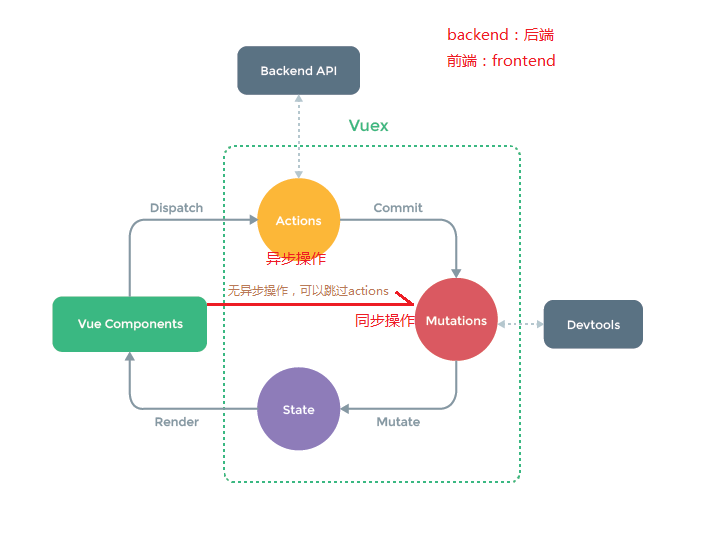
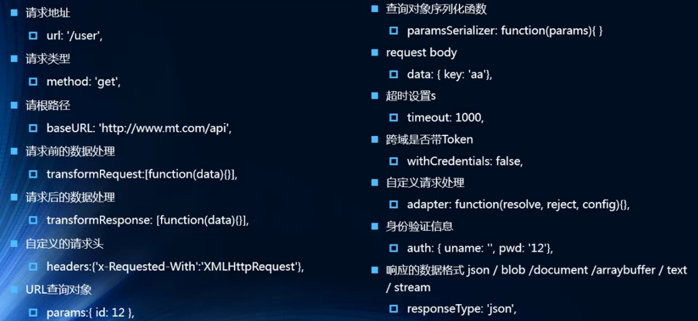

## 十六. ES6 Promise

#### 16.1 介绍Promise

Promise是做什么的？

> promise是异步编程的一种解决方案

什么时候会处理异步事件呢？

> 一种很常见的场景应该就是网络请求


**`promise`用于封装异步操作,属于链式编程**


什么情况下会用到Promise?

> 一般情况下是有异步操作时，使用Promise对这个异步操作进行封装
>
> new -> 构造函数(1.保存了一些状态信息 2. 执行传入的函数)
>
> 在执行传入的回调函数时，会传入两个参数，resolve, reject 这两个c本身又是函数

#### 16.2 Promise的使用

- 单个封装

```js
new Promise((resolve, reject) => {
  // 网络请求
  resolve()
}).then(() => {
 	// 具体操作
})
```


- 多个封装

```js
new Promise((resolve, reject) => {
  // 第一次网络请求的代码
  resolve()
}).then(() => {
 	// 第一次的处理代码
  
  // 多个回调
  return new Promise((resolve, reject) => {
  	// 第二次网络请求的代码
    resolve()
  })
}).then(() => {
    // 第二次的处理代码
    
    return new Promise((resolve, reject) => {
      // 第三次网络请求的代码
      resolve()
    })
  }).then(() => {
  	// 第三次的处理代码
})
```


##### Promise 里的两个参数 `resolve`，`reject`

- 使用`resolve`，会回调then()

- 使用`reject`， 会回调catch()

```js
new Promise((resolve, reject) => {
  setTimeout(() => {
  	// 成功的使用调用resolve
    resolve('Hello World')
    
    // 失败的时候调用reject
    reject('error message')
  }, 1000)
}).then(data => {
  console.log(data);
}).catch(err => {
	console.log(err);
})
```


Promise第二种写法

```
new Promise((resolve, reject) => {
  ...
}).then(函数一(成功时), 函数二(失败时))
```


```
new Promise((resolve, reject) => {
  ...
}).then(() => {
	...
}, () => {
	...
})
```


sync -> 同步

async -> 异步

#### 16.3 Promise三种状态

异步操作之后会有三种状态

- pending: 等待状态，比如正在进行网络请求，或者定时器还没到时间
- fulfill: 满足状态，当我们主动回调`resolve`时，就处于该状态，并且回调用`.then()`
- reject: 拒绝状态，当我们主动回调`reject`时，就处于该状态，并且回调`.catch()`


#### 16.4 Promise链式调用

- 链式调用`resolve`的简写

```js
return new Promise((resolve, reject) => {
  resolve('hcl')
})

// 简写一
return Promise.resolve('hcl')

// 再次简写
return 'hcl'
```

- 链式调用`reject`的简写

```js
return new Promise((resolve, reject) => {
  reject('err')
})

// 简写一
return Promise.reject('err')

// 再次简写
throw 'hcl'
```


#### 16.5 Promise.all方法

必须两个请求都完成，才回调then()

```js
Promise.all([
  new Promise((resolve, reject) => {
    ...
  }),
  new Promise((resolve, reject) => {
    ...
  })
]).then(results => {
  ...
})
```

Promise.all(参数为可遍历类型 []/{}等)

返回值下标[0] 是第一个请求结果，

返回值下标[1] 是第二个请求结果


## 十七. Vuex

#### 17.1 Vuex是做什么的？

> 官方解释：Vuex是一个专为Vue.js应用程序开发的**状态管理模式**
>
> 它采用**集中式存储管理**应用的所有组件的状态，并以相应的规则保证状态以一种可预测的方式发生变化
>
> Vuex也挤成到Vue官方调试工具devtools extension,提供了诸如零配置的time-travel调试、状态快照导入导出等高级调试功能

状态管理到底是什么？

> 可以简单将其看成需要多个组件共享的变量全部存储在一个对象里面
>
> 然后将这个对象放在顶层Vue实例中，让其他组件可以使用
>
> 那么过个组件是不是就可以共享这个对象中的所有变量属性了呢？

等等，如果是这样的话,为什么官方还要专门出一个插件Vuex呢？难道我们不能自家封装一个对象案例管理吗？

> 当然可以，只要我们先想想Vuejs带给我们最大的便利是什么？没错，就是响应式
>
> 如果你自己封装实现一个对象能不能保证它里面所有的属性做到响应式呢？ 当然也可以，只是自己封装可能稍微麻烦一些
>
> 不用怀疑，Vuex就是为了提供这样一个在多个组件间共享状态的组件，用它就可以了

管理什么状态呢？

> 多个界面需要共享的状态才放在Vuex里面管理

Talk is cheap,show me the code ———— linus


#### 17.2 安装并配置Vuex

安装：

```
npm install vuex --save
```


配置Vuex

```
// store/index.js

import Vue from 'vue'
import Vuex from 'vuex'

Vue.use(Vuex)

export default new Vuex.Store({
	// 状态
  state: {
  },
  mutations: {
  },
  actions: {
  },
  modules: {
  },
  getters: {
  }
})
```


#### 17.3 使用Vuex

拿Vuex的数据

```
$store.state.counter
```


多页面状态管理：

> 全局单列模式(大管家)
>
> 我们把需要共享的状态抽取出来，交给大管家统一进行管理
>
> 之后，你们每个试图按照我**规定好的**规则，进行访问和修改等操作
>
> 这就是Vuex背后的基本思想

Vuex状态管理图例：




#### 17.4 Vuex的五大核心

- state 状态
- getters 类似于计算属性
- mutations 类似于方法
- actions 异步操作
- modules 同步操作

[Vuex文档](https://vuex.vuejs.org/zh/)

##### state

- Vuex提出使用单一状态树，也叫单一数据源

- **将所有状态都放在一个store对象中**

访问state里的状态

```
this.$store.state.属性
```

---

##### getters

getters作为参数和传递参数

定义

```
getters: {
  // 计算属性
  aaa(state) {
    return 'Hello'
    })
  },
  // 将getters作为参数
  bbb(state, getters) {
    return getters.aaa + 'World'
  },

  // 传递参数
  ccc(getters) {
    return str => {
			return getters.bbb + str
    })
  }
}
```

调用getters里的属性

```
$store.getters.ccc('ccc')
```

---

##### mutations 

Vuex的store状态的更新唯一方式：**提交Mutation**

Mutation主要包括两部分：

- 字符串的**事件类型(type)**
- 一个**回调函数(handler)**，该回调函数的第一个参数就是state

mutation定义方式

```
mutations: {
  // 方法
  increment(state) {
    state.counter++
  }
}
```

通过mutation更新

```
// 使用$store的commit方法 调用大管家里面的方法，参数就是大管家的方法名
this.$store.commit('increment')
```

Mutation参数传递

在通过Mutation更新数据的时候，我们希望携带一些**额外的参数**

- 参数被称为是mutation的载荷(Payload)

```
this.$store.commit('类型', 载荷)
```

---

mutation提交风格

```
mutations: {
	// 普通
	increment(state, count) {
    state.counter += count
  }，
  // 特殊
  increment(state, payload) {
    state.counter += payload.count // 从对象中取count
  }
}
```

```
// 普通提交风格
this.$store.commit('increment', count)

// 特殊的提交风格
this.$store.commit({
	type: 'decrementCount', // 类型就是mutation方法的名字
	count 
})
```

普通提交风格打印结果 -> 普通类型

特殊提交风格打印结果 -> 对象

---

Mutations响应规则

Vuex的store中的state是响应式的，当state中的数据发生改变时，Vue组件会自动刷新

我们必须遵守一些Vuex对应的规则

- 提前在store中初始化好所需的属性
- 当给state中的对象添加新属性时，用下面的方式
  1. 使用`Vue.set(obj, 'newProp', 123)`
  2. 用新对象给旧对象重新赋值

删除用`Vue.delete(obj, 'oldProp')`

---

Mutation常量类型

```js
// mutation-types.js
export const SOME_MUTATION = 'SOME_MUTATION'
```

```js
// store.js
import Vuex from 'vuex'
import { SOME_MUTATION } from './mutation-types'

const store = new Vuex.Store({
  state: { ... },
  mutations: {
    // 我们可以使用 ES2015 风格的计算属性命名功能来使用一个常量作为函数名
    [SOME_MUTATION] (state) {
      // mutate state
    }
  }
})
```

Mutation同步函数

Mutation里面不要进行异步操作

使用action来进行异步操作


##### action

进行异步操作

```js
actions: {
	// context 上下文
	aaa(context) {
		// 返回一个Promise
		return new Promise((resolve, reject) => {
			comtext.commit('')
		})
	}
}

// ---------对象的解构-------------
// 实践中，我们会经常用到 ES2015 的 参数解构 来简化代码（特别是我们需要调用 commit 很多次的时候）
actions: {
  // 参数解构
	aaa({ commit}) {
		// 返回一个Promise
		return new Promise((resolve, reject) => {
      // 直接使用
			commit('')
		})
	}
}
```

```js
store.dispatch('aaa').then(() => {
  // ...
})
```


##### Module

为了不让store对象变得相当臃肿，我们可以将store分割成模块；每个模块拥有自己的 state、mutation、action、getter、甚至是嵌套子模块——从上至下进行同样方式的分割

```js
const moduleA = {
  state: { ... },
  mutations: { ... },
  actions: { ... },
  getters: { ... }
}

const moduleB = {
  state: { ... },
  mutations: { ... },
  actions: { ... }
}

const store = new Vuex.Store({
  modules: {
    a: moduleA,
    b: moduleB
  }
})

store.state.a // -> moduleA 的状态
store.state.b // -> moduleB 的状态
```

使用moduleA中的mutations/actions/getters都是直接使用

```
store.getters.属性名

store.commit(方法名)

store.dispatch(方法名)
```

**虽说分割成了小的模块，但是使用方法没有变，原来怎么访问的，分隔后就怎么访问**。

> 单一状态树还是原来单一状态树，改变了定义时的形式，但是并没有改变内部实质性的方法

如何取根节点状态？ -> `rootState`作为第三个参数

```js
const moduleA = {
  // ...
  getters: {
    sumWithRootCount (state, getters, rootState) {
      return state.count + rootState.count
    }
  }
}
```

---

## 十八. 网络请求封装

#### 18.1 axios请求方式

- axios(config)
- axios.request(config)
- axios.get(url[,config])
- axios.delete(url[,config])
- axios.head(url[,config])
- axios.post(url[,data[,config]])
- axios.put(url[,data[,config]])
- axios.patch(url[,data[,config]])


```js
// 默认返回Promise
axios({
  url: 'http://123.207.32.32:8000/home/multidata',
  method: '请求方式',
  // 专门针对get请求的参数拼接
  params: {
    type: 'pop',
    page: '1'
  }
}).then(res => {
  
})
```


#### 18.2 并发请求

`axios.all`方法可以同时请求多个，这个方法返回的是数组，使用`axios.spread`可将数组展开res1, res2

```js
axios.all([axios({
  // 请求一
}), axios({
  // 请求二
})]).then(results => {
	
})
// .then(axios.spread((res1, res2) => {
// 		...
// }))
```


#### 18.3 全局配置

在开发中很多参数都是固定的，可以利用axios的全局配置

```js
axios.default.baseURL = 'http://123.207.32.32:8000'
axios.default.timeout = 5000

axios.all([axios({
  url: '/home/multidata',
}), axios({
  url: '/home/data'，
  params: {
  	type: 'pop',
  	page: 1
	}
})]).then(results => {
  console.log(results)
})
```


#### 18.4 get和post

`params`针对`get`请求

```js
axios({
  url: '',
  method: 'get',
  params: {
    ...
  }
})
```

`data`针对`post`请求

```js
axios({
  url: '',
  method: 'post',
  data: {
    ...
  }
})
```


#### 18.5 常见配置选项




#### 18.6 创建对应的axios实例

```js
const instance1 = axios.create({
  baseURL: '',
  timeout: 3000
})

instance1({
  url: ''
}).then(res => {
  ...
})
```


#### 18.7 封装网络请求模块

#### 18.8 axios拦截器

- 请求拦截

```js
instance1.interceptors.request.use(config => {
  // 请求成功
  
  // 有以下情况都可以使用拦截器
  // 1. 比如config中得一些信息不符合服务器的要求
  // 2. 比如每次发送网络请求时，都希望在界面中显示一个请求的图标
  // 3. 某些网络请求(比如登录(token)),必须携带一些特殊的信息
  
  return config	// 必须返回，不然服务器返回的信息就被拦截掉了，后续拿不到结果
}, err => {
  // 请求失败
})
```

- 响应拦截

```js
instance1.interceptors.response.use(results => {
  // 响应成功
  
  return results.data	// 我们只需要data，其他的都是服务器拼接上去的
}, err => {
  // 响应失败
})
```

