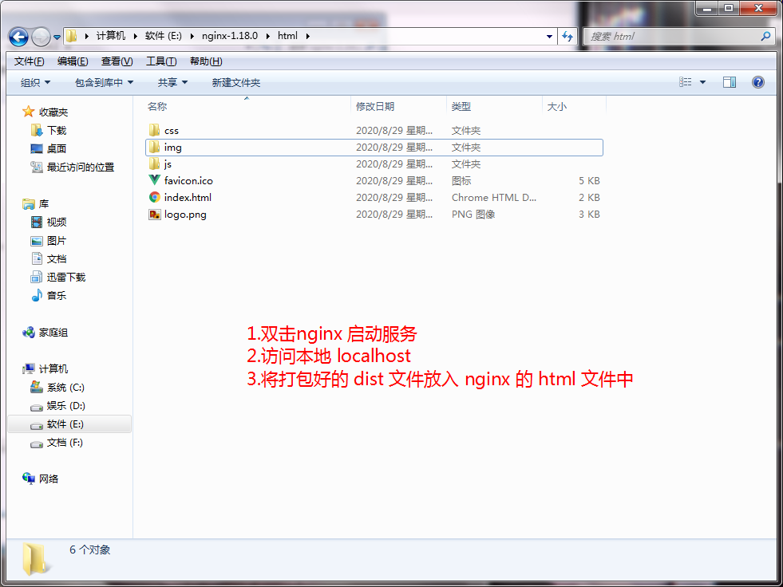
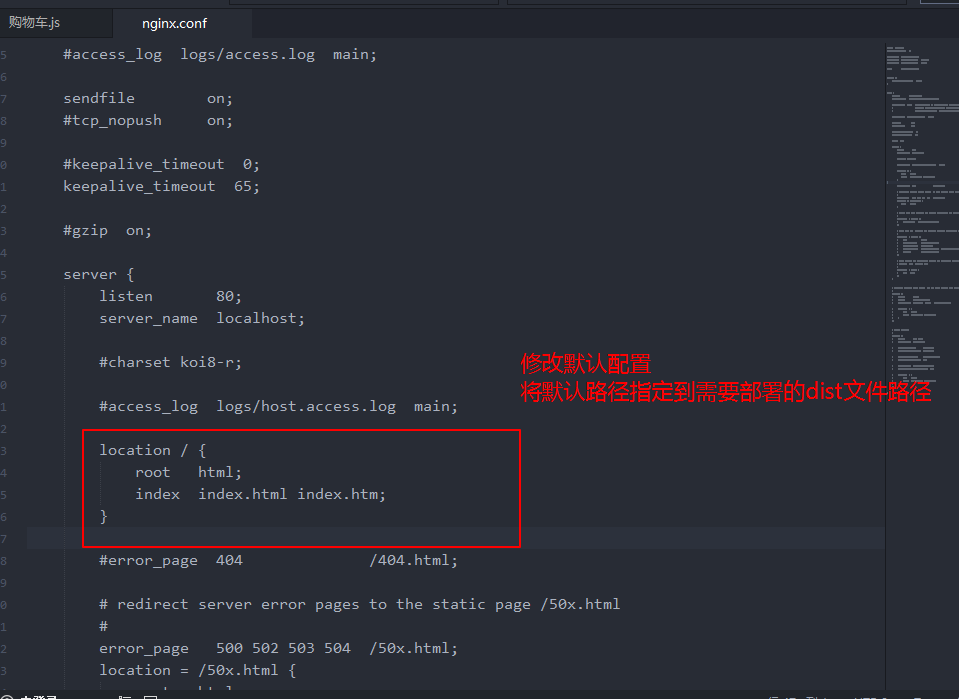

## 商城项目


1. 划分目录结构


2. 引入了两个CSS文件


3. vue.config.js 和 .editorconfig

```vue
// vue.config.js

module.exports = {
  configureWebpack: {
    resolve: {
      alias: {
        'assets': '@/assets',
        'common': '@/common',
        'components': '@/components',
        'network': '@/network',
        'views': '@/views'
      }
    }
  }
}
```

```
// .editorconfig

root = true

[*]
charset = utf-8
indent_style = space
indent_size = 2
end_of_line = lf
insert_final_newline = true
trim_trailing_whitespace = true
```


4. 项目的模块划分：tabbar -> 路由映射关系


5. 修改图标

```
<link rel="icon" href="<%= BASE_URL %>logo.png">
```


6. 导航条抽成组件


7. 请求首页多个数据

函数调用 -> 压入函数栈(保存函数调用过程中的所有变量)

函数调用结束 -> 弹出函数栈(释放函数中所有的变量)

```
// home.js

import {request} from "./request";

export function getHomeMultidata() {
  return request({
    url: '/home/multidata'
  })
}
```

```
// home.vue

created() {
  getHomeMultidata().then(results => {
    // console.log(results);
    this.banners = results.data.banner.list
    this.recommend = results.data.recommend.list
  })
}
```


8. 轮播图
9. 首页推荐
10. 商品列表导航停留

```
/*
  sticky属性： 当没有达到这个位置之前position:static,当达到这个值的时候position:fixed
  但是很多浏览器不支持，一般移动端都支持
*/
position: sticky;
```

11. 请求商品列表数据

代码规范：具体实现方法放到methods里面

```
created() {
  // 1.请求多个数据
  this.getMultidata()

  // 2.请求商品列表数据
  this.getHomeGoods()
},
```

```
methods: {
  getHomeGoods() {
    getHomeGoods('pop', 1).then(res => {
      console.log(res);
    })
  }
}
```

12. 移动端开发滚动条

适配移动端滚动

- iscroll框架  - 已暂停使用

- better-scroll 

```
npm install better-scroll --save
```

[better-scroll官方文档](https://better-scroll.github.io/docs/zh-CN/guide/)

官方图片:


better-scroll监听事件

- 监听滚动

```js
import BScroll from '@better-scroll/core'
let wrapper = document.querySelector('.wrapper')
let bs = new BScroll(wrapper, {
  // 默认情况下BScroll是不可以实时的监听滚动位置
  // probe 侦测
  // 0,1都是不侦测实时的位置
  // 2: 在手指滚动的过程中侦测，手指离开后的惯性滚动过程中不侦测
  // 3: 只要是滚动，都侦测
  probeType: 3,
})
```

```js
bs.on('scroll', position => {
	...
})
```

- 控制元素点击 `click`

默认是不能进行事件点击

```
let bs = new BScroll(this.$refs.wrapper, {
	click: true
})
```


- 上拉加载更多

```js
import BScroll from '@better-scroll/core'
let wrapper = document.querySelector('.wrapper')
let bs = new BScroll(wrapper, {
  pullUpLoad: true  // 开启下拉加载更多功能
})
```

```js
bs.on('pullingUp', () => {
	console.log('上拉加载更多')
	setTimeout(() => {
		bs.finishPullUp()	// 标识一次上拉加载动作结束。
	}, 2000)
})
```


13. ref属性

ref如果是绑定在组建中，那么通过`this.$refs.refname`获得到的是一个组件对象

ref如果是绑定在普通元素中，那么通过`this.$refs.refname`获得到的是一个元素对象


14. 样式作用域 `scoped`

```
<style scoped>
  .wrapper {
    height: calc(100vh - 50px);
    background-color: #42b983;
  }
</style>
```


15. 监听组件点击！！！

    修饰.native修饰什么时候使用？

    - 在我们需要监听一个组件的原生事件时，必须给对应的事件加上.native修饰符，才能进行监听

---

### 一.FeatureView

- 独立组件封装 FeatureView
  - div>a>img

#### 二. TabControl

- 独立组件的封装
  - props -> titles
  - div>根据titles v-for遍历div -> span{{title}}
  - css相关
  - 选中哪一个tab，哪一个tab的文字颜色变色，下边有border-bottom
    - currentIndex


### 三. 首页上坪数据的请求

####  3.1 设计数据结构，用于保存数据

goods: {

pop: page/list,

new: page/list,

sell: page/list

}


#### 3.2 发送数据请求

- 在home.js中封装getHomeGoods(type, page)
- 在Home.vue中，又在methods中getHomeGoods(type)
- 调用getHomeGoods('pop')/getHomeGoods('new')/getHomeGoods('sell')
  - page: 动态的获取对应的page
- 获取到数据： res
  - this.goods[type].list(...res.data.list)
  - this.goods[type].page += 1

goods: {

pop: page: 1/list[30],

new: page: 1/list[30],

sell: page: 1/list[30]****

}


### 四.对商品数据进行展示

#### 4.1 封装GoodsList.vue组件

- props: goods -> list[30]
- v-for goods -> GoodsLsistItem[30]
- GoodsListItem(组件) -> GoodsItem(数据)


#### 4.2 封装GoodsListItem.vue组件

- props: goodsItem
- goodsItem 取出数据，并且使用正确的div/span/img基本标签进行展示


### 五. 对滚动进行重构: Better-Scroll

#### 5.1 在index.html中使用Better-Scroll

- const bscroll = new BScroll(el, { })
- 注意： wrapper -> content -> 很多内容
- 1.监听滚动
  - peobeType: 0/1/2(手指滚动)/3(只要是滚动)
  - bscroll.on('scroll', position => { })
- 2.上拉加载更多
  - pullUpLoad: true
  - bscroll.on('pullingUp', () => {})
- 3.click: false
  - button可以监听点击
  - div不可以

#### 5.2 再Vue项目中使用Better-Scroll

- 简单演示Better-scroll
- 对Better-Scroll进行封装： Scroll.vue
- Home.vue和Scroll.vue之间进行通信
  - Home.vue传入值probeType:3
  - Scroll.vue需要通过$emit,实时将时间发送到Home.vue

### 六. 回到顶部BackTop

#### 6.1 对BackTop.vue组件的封装

#### 6.2 如何监听组件

- 直接监听back-top的点击，但是可以直接监听吗？
  - 不可以,使用修饰符`.native`

- 回到顶部
  - scroll对象, scroll.scrollTo(x, y, time)
  - this.$refs.scroll.scrollTo(0, 0, 300)


#### 6.3 BackTop组件的显示和隐藏

- isShowBackTop: false
- 监听滚动，拿到滚动的位置
  - this.isShowBackTop = Math.abs(position.y) > 1200


### 七. 解决首页中可滚动区域的问题

- Better-Scroll在决定有多少区域可以滚动时，时更具scrollerHeight属性决定
  - scrollerHeight属性是根据Better-Scroll的content中的子组件的高度
  - 但是我们的首页中，刚开始在计算scrollerHeight属性时，是没有将图片计算在内的
  - 所以，计算出来的高度是错误的(1300+)
  - 后来图片加载进来之后有了新的高度，但是scrollerHeight属性并没有进行更新
  - 所以滚动出现了问题
- 如何解决这个问题？
  - 监听每一张图片是否加载完成，只要有一张建在完成了，执行一次refrensh()
  - 如何监听图片加载完成了？
    - 原生的js监听图片: `img.onload = function() {}`
    - Vue中监听: `@load='方法'`
  - 调用scroll的refresh()
    - refresh()	//刷新，重新计算可滚动区域高度
- 如何将GoodsListItem.vue中的时间传入到Home.vue中
  - 因为涉及到非父子组件的通信，所以这里我们选择了**事件总线**
  - bus -> 总线
  - Vue.proteType.$bus = new Vue()
  - this.$bus.$emit('事件名称', 参数) //发射事件
  - this.$bus.$on('事件名称', 回调函数(参数)) // 使用事件

- 对于refresh非常频繁的问题，进行防抖操作
  - 防抖debounce/节流throttle
  - 防抖函数起作用的过程：
    - 如果我们直接执行refresh，那么refresh函数会被执行30次
    - 可以将refresh函数传入到debounce函数中，生成一个新的函数
    - 之后再调用非常频繁的时候，就使用新生成的函数
    - 而新生成的函数并不会非常频繁的调用，如果下一次执行来的非常狂，那么会将上一次取消掉

```
debounce(func, delay) {
  let timer = null
  return (...args) => {
    if(timer) clearTimeout(timer)
    timer = setTimeout(() => {
      func.apply(this, args)
    }, delay)
  }
}
```


所有的组件都有一个属性`$el`，用于获取组件中的元素

BetterScroll吸顶效果实现

在加一个`tab-control`标签 默认是隐藏 当到达吸顶距离时 显示新的标签

```
swiperImgLoad() {
  // 获取tabControl的offsetTop
  this.tabOffsetTop = this.$refs.tabControl.$el.offsetTop
}
```

```
contentClick(position) {
  // 条件满足为true
  // 1.判断BackTop是否显示
  this.isShowBackTop = Math.abs(position.y) > 1200

  // 2.决定tabControl是否吸顶(position: fixed)
  this.isTabFixed = Math.abs(position.y) > this.tabOffsetTop
}
```


### 八. tabControl的吸顶效果

#### 8.1 获取到tabControl的offsetTop

- 必须知道滚动到多少时，开始有吸顶效果，这个时候就需要获取tabControl的offsetTop
- 但是，如果直接在mounted中获取tabControl的offsetTop，那么值是不正确的
- 如何获取正确的值？
  - 监听HomeSwiper中img的加载完成
  - 加载完成后，发出事件，在Home.vue中，获取正确的值
  - 补充：
    - 为了不让HomeSwiper多次发出事件
    - 可以使用isLoad的变量进行状态的记录
  - 注意：这里不进行多次调用和`debounce`的区别

#### 8.2 监听滚动，动态改变tabControl样式

- 问题：动态的改变tabControl的样式时，会出现两个问题
  - 问题一：下面的商品内容，会突然下移
  - 问题二：tabControl虽然设置了fixed，但是也随着Better-Scroll一起滚出去了
- 其他方案来解决停留问题
  - 在最上面，多复制了一份PlaceHolderTabControl组件对象，利用它来实现停留效果
  - 当用户滚动到一定位置时，PlaceHolderTabControl显示出来
  - 当用户滚动没有达到一定位置时，PlaceHolderTabControl隐藏起来


### 九. 让Home保持原来的状态

#### 9.1 让Home不要随意销毁掉

- keep-alive

#### 9.2 让Home中的内容保持原来的位置

- 离开时，保存一个位置信息saveY
- 进来时，将位置这只为原来保存的位置saveY信息即可
  - 注意： 最好回来时，进行一次refresh()


### 十. 服务器返回的时间

#### 10.1 时间戳

> 从服务器返回的时间不是这种格式: 2020/7/25 14:09
>
> 而是以unix时间元年为起点，返回对应的时间戳: 1535694719(秒)

问题：如何将 时间戳 转成时间格式化字符串(常用)

时间戳: 1535694719(秒)

1.将时间戳翻转成Date对象

const date = new Date(1535694719 * 1000)  //单位是 毫秒

2.将date进行格式化，转成对应的字符串

date -> FormatString(太常用)

> y: year
>
> M: Month (两个m做区别)
>
> d: day
>
> h: hours(h(12小时) / H(24小时))
>
> m: minutes
>
> s: seconds


### 十一. 混入[mixins](https://cn.vuejs.org/v2/guide/mixins.html)

- 创建混入对象: const mixin = {}
- 组件对象中: mixins: [mixin]


### 十二. 标题和内容的联动效果

#### 12.1 点击标题，滚动到对应的主题

- 在detail中监听标题的点击，获取index
- 滚动到对应的主题： 
  - 获取所有主题的offsetTop
  - 问题： 在哪里才能获取到正确的offsetTop
     1. created肯定不行，压根不能获取元素
     2. mounted也不行，数据还没有获取到
     3. 获取到数据的回调中也不行,DOM还没有渲染完
     4. $nextTick也不行，应为图片的高度没有被计算在内
     5. 在图片加载完成后，获取的高度才是正确值

#### 12.2 内容滚动，显示正确的标题

普通做法：

```
(this.currentIndex !== i) && ((i < length - 1 && positionY >= this.themeTopYs[i] && positionY < this.themeTopYs[i + 1]) || (i === length - 1 && positionY >= this.themeTopYs[i]))

条件成立：this.currentIndex !== i
条件一：防止赋值的过程过于频繁
条件二：((i < length - 1 && positionY >= this.themeTopYs[i] && positionY < this.themeTopYs[i + 1]) || (i === length - 1 && positionY >= this.themeTopYs[i]))
条件1：(i < length - 1 && positionY >= this.themeTopYs[i] && positionY < this.themeTopYs[i + 1])
* 判断区间：在 0 和 某个数字 之间 (i < length - 1)
条件2：(i === length - 1 && positionY >= this.themeTopYs[i])
* 判断大于等于：i === length - 1
```

hack做法：

```
(this.currentIndex !== i) && (positionY >= this.themeTopYs[i] && positionY < this.themeTopYs[i + 1])
借用最大值 减少判断条件
```


空间换时间(执行性能/写代码时间)

### 十三. 顶部工具栏的封装

### 十四. 详情页的回到顶部

- home.vue和detail.vue回到顶部: mixin

### 十五. 点击加入购物车

#### 15.1 监听加入购物按钮的点击，并且获取商品信息

- 监听
- 获取商品信息: iid/price/image/title/desc


#### 15.2 将商品添加到Vuex中

- 安装vuex
- 配置vuex
- 定义mutations 将商品添加到state.cartList
- 重构代码:
  - 将mutations中的代码抽取到actions中(定义两个mutations)
  - 将mutations/actions单独抽取到文件中


### 十六. 购物车的展示

#### 16.1 购物车的导航栏的展示


#### 16.2 购物车商品的展示

- CartList -> Scroll(滚动问题)
- CartListItem -> CheckButton


#### 16.3 商品的选中和不选中切换

- 修改模型对象，改变选中和不选中


#### 16.4 地步工具栏的汇总

- 全选按钮
- 计算总价格
- 去计算：

### 十七. 购物车的全选按钮

- 显示的状态
  - 判断是否有一个为不选中，全选按钮就不选中状态
- 点击全选按钮
  - 如果原来都是选中，点击一次，全部不选中
  - 如果原来都是不选中(某些不选中)，点击一次，全部选中


### 十八. 添加购物车弹窗

#### 18.1 `Toast`(吐司)

#### 点击加入购物车 弹窗 -> 已添加至购物车;这种弹窗被称为`Toast`(吐司)

- `Toast`(吐司)封装

1. 普通封装方式
2. 插件封装方式


#### 18.2 Vuex的补充

1.如果在Vuex里面做了某个操作 想让外面知道我完成了这个操作 需要使用`promise`

2.既然有`mapGetters`(计算属性)  那么相对的也就有`mapActions`(方法)


### 十九. 补充一些说明

#### 19.1 fastClick解决移动端点击300ms延迟

- 安装fastclick

- 导入

- 调用attach函数 

  - ```
    FastClick.attach(document.body)
    ```

#### 19.2 图片的懒加载

- 什么是图片懒加载？
  - 图片需要现在在屏幕上时，再记载这张照片
- 使用vue-lazyload库
  - 安装
  - 导入
  - Vue.use()
  - 修改img :src -> v-lazy

#### 19.3 px2vw插件使用(单位转换)

- 安装插件
- 在postcss.config.js中配置

### 


retina 1点 2个像素

375 -> 15px

750 -> 30px

设计稿: iPone(750x1334)


### 二十. 使用nginx部署项目

主机-> 操作系统 -> window(.net)/Linux -> tomcat/nginx(软件/反向代理)

第一： 将自己的电脑作为服务器 -> window -> nginx(服务器)





关闭服务: `nginx -s stop`

第二: 远程部署